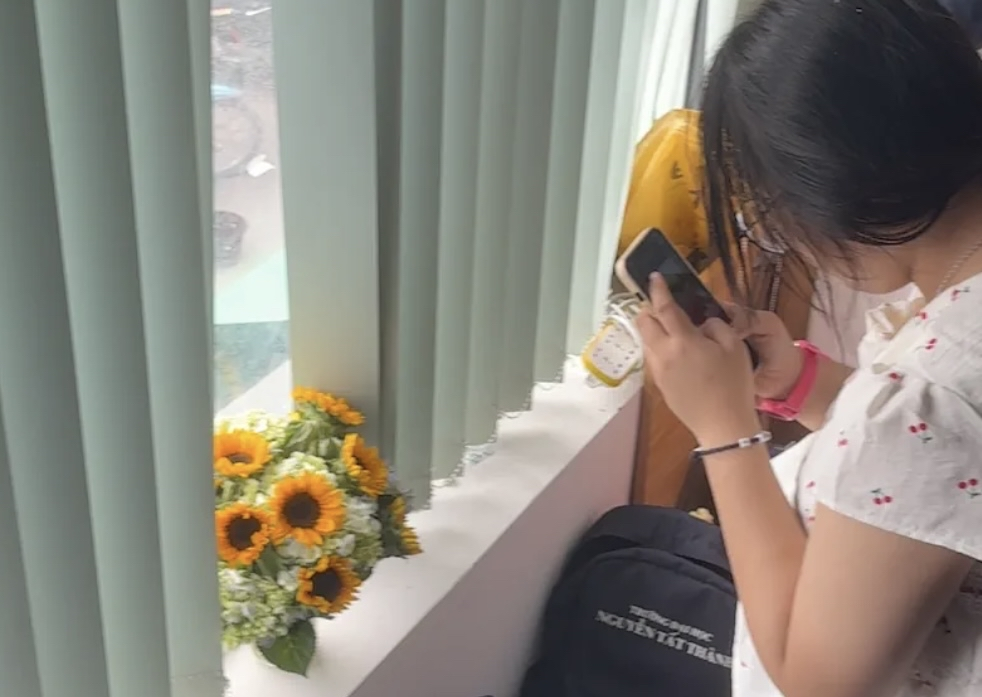
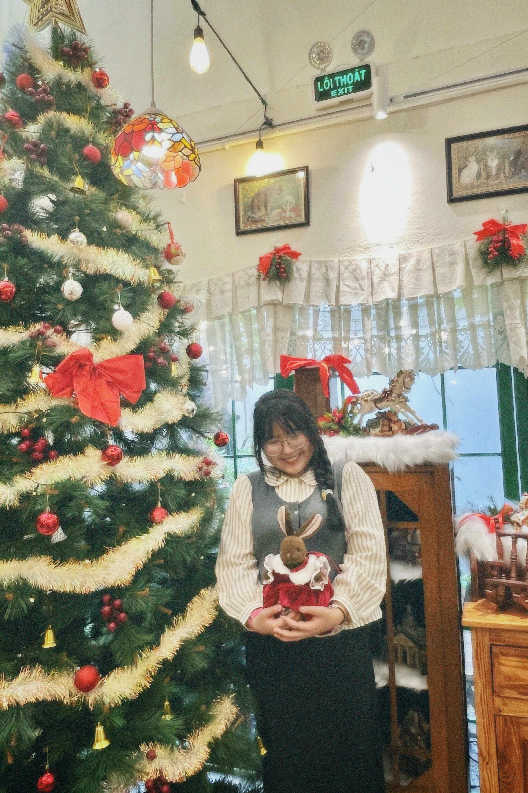

<!DOCTYPE html>
<html lang="vi">
<head>
  <meta charset="utf-8" />
  <meta name="viewport" content="width=device-width,initial-scale=1" />
  <title>Thiệp Sinh Nhật - Nhấn để hiện quà</title>
  
</head>
<body>
  

    <button class="open-btn" id="openBtn">Nhấn vô nha🎁</button>

    

      

        
        
      

      

        Chúc mừng sinh nhật em. Chúc em tuổi mới đầy niềm vui và hạnh phúc!
        Chúc em có tất cả trừ vất vả.
        <small>Hôm nay là của em nên hãy luôn mỉm cười nhé em 🎉</small>
      

    

    <!-- falling flower canvas -->
    <canvas id="fallCanvas" class="decor"></canvas>
  

  
</body>
</html>
